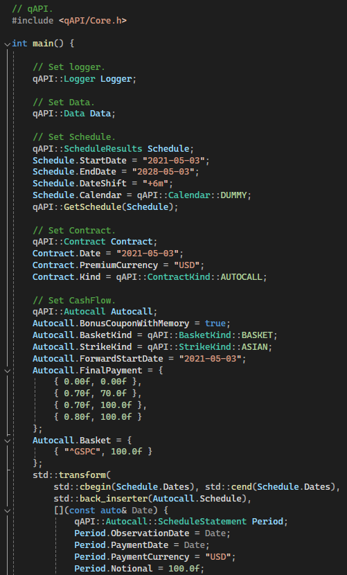
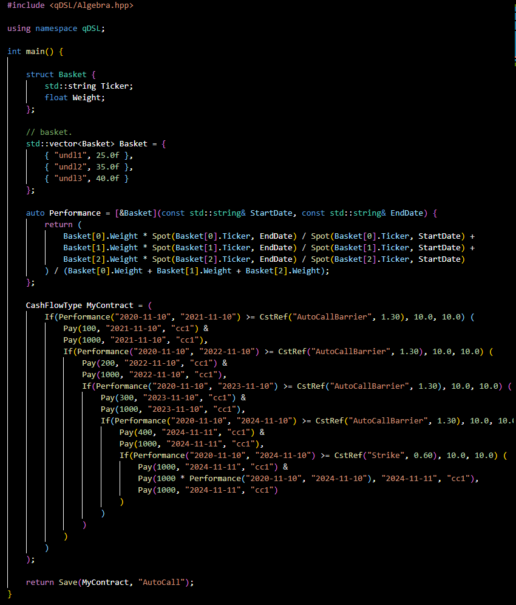
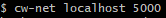
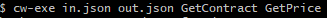

<h1 align="center">

</h1>

Cegaware is a comprehensive solution for sales, traders and   structurers to manage their financial contracts.

  

# Table of Contents

1. [Products](#products)
   1. [cw-gui](#cw-gui)
   2. [cw-api](#cw-api)
   3. [cw-dsl](#cw-dsl)
   4. [cw-net](#cw-net)
   5. [cw-exe](#cw-exe)
2. [Features](#features)
   1. [Contract](#contract)
   2. [Data](#data)
   3. [Model](#model)
   4. [Pricer](#pricer)
3. [Services](#services)
   1. [Pro](#pro)
   2. [FAQ](#faq)
4. [Workstyle](#workstyle)
   1. [Integration and Delivery](#Integration and Delivery)

# <a name="products">Products</a>

⏩ Cegaware provides multiple products for practicionners to run customized analysis on their structured product positions.

## <a name="cw-gui">cw-gui</a>

🎮 Use our cross-platform GUI desktop application to assess, import and export your analysis through a smooth and modern graphical interface.

## <a name="cw-api">cw-api</a>

🎮 Connect your devices to our low level C dynamic-link library and have access to a comprehensive library of functions callable from your systems.

<h1 align="left">

</h1>

## <a name="cw-py">cw-py</a>

🎮 Automate your workflows with our python package for a flexible alternative to the API with calculations left to the C binaries for more performance.

## <a name="cw-dsl">cw-dsl</a>

🎮 Design any contracts with a simple language: a fully efficient and generic aproach for contract description which our whole codebase is built upon.

<h1 align="left">

</h1>

## <a name="cw-net">cw-net</a>

🎮 Launch your own instance of our web service on your most powerful hardwares and make it available for your teams for more performance.

<h1 align="center">

</h1>

## <a name="cw-exe">cw-exe</a>

🎮 Execute your API requests locally with our embedded executable.

<h1 align="center">

</h1>

# <a name="features">Features</a>

⏩ Book your contract, plug your market data providers, set your pricing configuration and explore a set of features to manage your risks.

## <a name="contract">Contract</a>

Cegaware offers multiple flavor to book your contract: ​

**​Template**: Choose among a large selection of templates that covers the best known structures commonly used in the industry. If you cannot find a one that suits your need, we can make it available in just a couple of hours thanks to our generic contract description framework.

**Language**: cw-dsl is a static C++ library that implements our simple and intuitive algebra to design any contracts and export it to a file that contains the  encoded contract information.

**Console**: A script that follows the grammar of our domain-specific language that can be directly inputted to your contract configuration.

## <a name="data">Data</a>

Once you have subscribed to our service, you will be received a username and a password that will let you input your external providers credentials to your data configuration in cegaware. Cegaware will then be able to request your providers for the market data needed to perform the action you asked.

If needed, we take in charge the entire development of the API specific to your providers that will allow Cegaware to communicate with any of your third-party data feed.

If you have not subscribed to our service, you can always leave your data configuration empty to access our demo market data base and still use our whole set of features for free.

## <a name="model">Model</a>

Cegaware proposes a large selection of financial models to evaluate your contracts.

A close assistance can be provided based on expert considerations to help you to select the model that offers the best performance in terms of hedging costs, P&L explanation and computation efficiency regarding the contract you wish to analyse.

We are working consistently to improve the performance of our existing models in terms of speed and accuracy and are keeping aware of new methodologies able to better handle market effects.

In particular Cegaware can adapt your own models if any and integrate it into the solution for your needs.

## <a name="pricer">Pricer</a>

Only three pricers to rule them all: Combined with variance reduction methods, barrier smoothing techniques and multihreading, our pricers produce accurate and reliable price and sensitivities:

A generic Monte Carlo engine that handles any complex contracts from vanillas to the most exotics.

For contracts with weak path dependency and low dimension, a pricer based on Finite Difference Method can be prefered to improve the accuracy.

Eventually, a Closed Form Method is proposed if the contract suits it well.

# <a name="services">Services</a>

## <a name="pro">Pro</a>

We are happy to discuss with you about what you need and how Cegaware can help you with your business.

A first meeting can be organized in order to understand your expectations and answer any further inquiries.

Upon agreement by both parties, we might need to develop an API specific to your providers that will allow Cegaware to communicate with any of your third-party data feeds.

Once ready to work, you will be received a username and password that will let you input your external providers credentials to your data configuration in Cegaware.

We can then proceed with the integration of Cegaware within your workflow and provide a daily and immediate support in case of bugs, new features, any tutorials you might need and any bigger project you want us to carry on for a better experience with our technology.

# <a name="workstyle">Workstyle</a>

⏩ Explore the backstage of our developement workflow. All the products we maintain are cross-platform.

<h1 align="center">

</h1>

| Name        | OS           | Provider                              | RAM     | CMake        | CMake Generator       | Build Type      | Compiler           | Build Status |
| ----------- | ------------ | ------------------------------------  | ------- |------------- | --------------------- | --------------- | ------------------ | ------------ | 
| Win32-MinGW | Windows 10   | -                                     | 8.00 GB | CMake-3.28.3 | MinGW Makefiles       | Release & Debug | GCC-13.2.0         | ✅           |
| Win32-MSVC  | Windows 10   | -                                     | 8.00 GB | CMake-3.28.3 | Visual Studio 17 2022 | Release & Debug | MSVC-19.30.30709.0 | ✅           |
| Linux       | Ubuntu 22.04 | [Hostinger](https://www.hostinger.fr) | 8.00 GB | CMake-3.22.1 | Unix Makefiles        | Release & Debug | GCC-11.4.0         | ✅           |
| MacOS       | Sonoma 14.4  | [UltaHost](https://ultahost.com)      | 2.00 GB | CMake-3.28.3 | Unix Makefiles        | Release & Debug | CLANG-1500.3.9.4   | ✅           |

**Treatment**: Once a bug is reported, a feature is requested or a payoff is needed, we add a new ticket to our backlog tagged with the corresponding flag (bug, feature, payoff, misc).

**Developement**: A branch is then created in our repository which is located on a private GitHub repository which access is restricted to our developpers only. In order to ensure that the code change is not broken by any subsequent modifications, at the end of each dev session, a new non-regression test is submitted to the tests suite together with a contract file that replicates the target behavior.

**Integration**: Once the task is done, a pull request is submitted which triggers our custom GitHub actions to execute builds and tests on our Windows, Linux and MacOS self-hosted runners.
The branch is merged with our codebase if and only if all builds and tests passed on all tested configurations.

**Delivery**: A new package is deployed every business day at 23:59 and its name follows the semantic versioning principles. To publish a new release, we launch a shell script that writes a changelog and pushes a tag that triggers a packaging for each configurations supported. A bug reported (resp. payoff requested) on the day D will have its corresponding fix (resp. template) available for all users on day D+3. For new features, an estimated time of arrival (ETA) is communicated depending on the complexity of the task required and in the meantime some meetings might be organized for you to follow up the progression of the project.